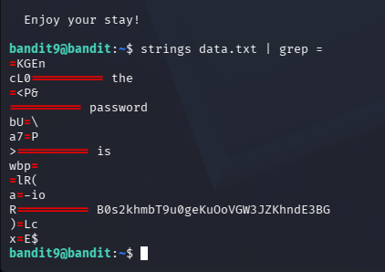

# Goal 
The password for the next level is stored in the file data.txt in one of the few human-readable strings, preceded by several ‘=’ characters.
# Step
First we try running 
```bash
cat data.txt
```
The output contains binary data that is not human-readable 

therefore, we use `strings` to extract human-readable text and pipe it to `grep`  to find lines containing `=`
```bash 
strings data.txt | grep =
```
Output 

 

# Password
```bash 
B0s2khmbT9u0geKuOoVGW3JZKhndE3BG
```
