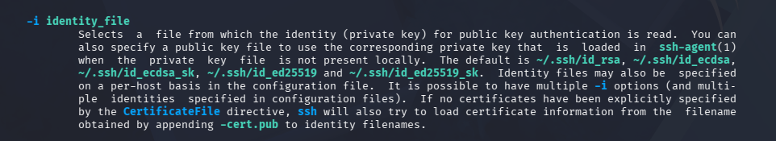

# Goal 
``` Text 
The password for the next level is stored in /etc/bandit_pass/bandit14 and can only be read by user bandit14. For this level, you don’t get the next password, but you get a private SSH key that can be used to log into the next level. Look at the commands that logged you into previous bandit levels, and find out how to use the key for this level.
If you need help with this level: a hint file can be found in the home directory.
Make sure to read the error messages as they are informative.
```
# Steps 
Log in to `bandit13` and check the dictionary contents 
```bash 
ls 
```
Output 
```Text 
sshkey.private 
``` 
The dictionary contains a file named `sshke.private`
```bash 
scp -P 2220 bandit13@bandit.labs.overthewire.org:~/sshkey.private 
``` 
Since SSH private keys require strict permissions, I will check the file's current permissions:
```bash 
stat sshkey.private 
``` 
Output  
```Text 
 File: sshkey.private
  Size: 2602            Blocks: 8          IO Block: 4096   regular file
Device: 8,1     Inode: 709888      Links: 1
Access: (0640/-rw-r-----)  Uid: ( 1000/    kali)   Gid: ( 1000/    kali)
Access: 2026-08-21 06:09:33.041490679 -0400
Modify: 2026-08-21 06:09:33.413676689 -0400
Change: 2026-08-21 06:09:33.413676689 -0400
 Birth: 2026-08-21 06:09:33.041490679 -0400
 ``` 
 Notable information:
 ```Text
 Access: (0640/-rw-r-----)  Uid: ( 1000/    kali)   Gid: ( 1000/    kali)
 ```
 This means the group has read access to the file. 

 Change the file permission to `600`  
 ```bash
 chmod 600 sshkey.private
 ```
reason



Now, connect to `bandit14` using the private key and read the password:
```bash 
ssh -i sshkey.private -p 2220 bandit14@bandit.labs.overthewire.org 
cat /etc/bandit_pass/bandit14
```
# Password 
```Text 
aaWecNkG4FhxJQxz07uiwzVP6bJiYS65
```