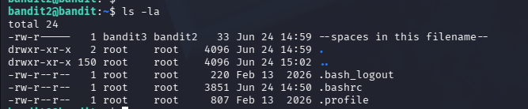

# Goal
findout the password in the file named "--space in this filename--"
# process
First we will join in with the user bandit2, the use this command
```bash 
ls -la 
```
it will display this

you can see the ` --spaces in this filename-- `
But when i use 
```bash 
cat ./--spaces in this filename--
``` 
the system can't understand. Because there are spaces in this file name, so to make the system understand what you command. We will use
```bash 
cat ./--spaces\ in\ this\ filename--
```
OR put it in to the single or double quotation marks like this
```bash 
cat ./"--spaces in this filename--"
```
# Password
```bash 
7ZZ2LFrykP2zEyvBl4m3clcL7tGYJPME
```