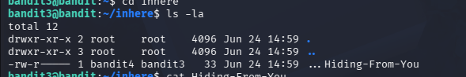

# Mission
findout the password in the hidden file in the inhere directory
# Steps
Now we will use this command to see what we have 
```bash 
ls 
```
We can see the directory named `inhere`

to login to this directory
```bash 
cd inhere
```
we will use the command `ls` again, but there nothing in this directory

But we need to ensure that there are nothing in this directory, we will use 
```bash 
ls -la
```
the system display 



So we can see the file named ...Hiding-From-You

We will use:
```bash 
cat ...Hiding-From-You
```
# Password
```bash
xzTXq1rDJQVVAzdv5cHq1TQytTWufAMq
```
