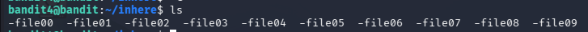

# Goal 
Find out the password in the human-readable file format in the inhere directory
# Step
Performs the same steps as in lvl3-4, after entering the `inhere` directory 
```bash
ls
```
we got the following output



The directory contains files named from -file00 to -file09

We will attempt to read each file from -file00 through -file09

File -file07 contains human-readable text
# Password 
```bash 
6C7h9GD8M6ai5nr7wo1RonrzFjj9yIrG
```