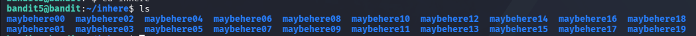
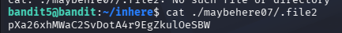

# Goal
The password for the next level is stored in a file somewhere under the inhere directory and has all of the following properties:

human-readable 

1033 bytes in size

not executable

# Steps
After entering the `inhere` directory, run the following command 
```bash 
ls
```
 
The system displays 



The directory contains subdirectories named from maybehere00 to maybehere19

Each dictionary contains 5 files

To find the correct file, we will use the following command
```bash 
find . -type f -size 1033c ! -executable
```
# Password
